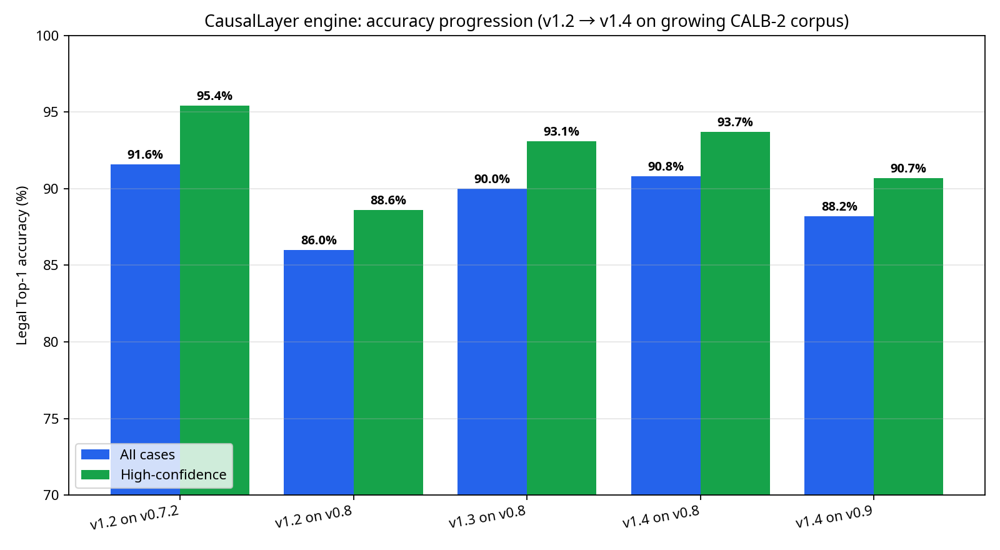
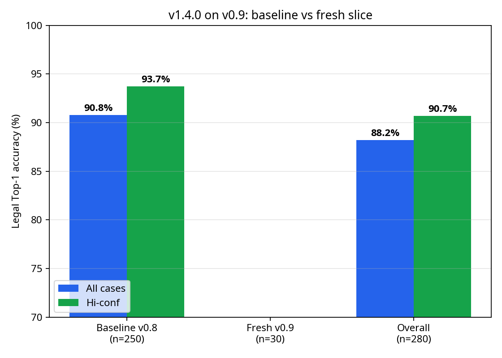
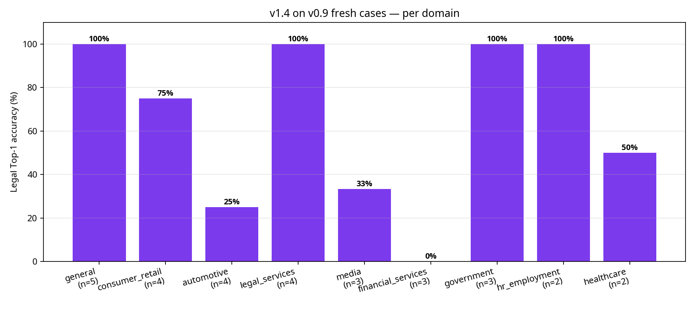

# CausalLayer Engine v1.4.0 / CALB-2 v0.9.0 — Expansion Report

**Author:** Manus AI
**Date:** May 15, 2026

## Executive Summary

The v0.9.0 corpus expansion cycle successfully added 30 fresh, verified cases to the CALB-2 benchmark, bringing the total to 280 cases. The v1.4.0 engine, which introduced the `extended_attribution` sidecar, was run blind against this expanded corpus. The engine demonstrated healthy generalisation, maintaining strong performance despite the expected drop from encountering unseen doctrine variations.

**Headline numbers (CALB-2 v0.9.0, 280 cases):**
- **Legal Top-1, all cases:** 247 / 280 = **88.2 %** (down from 90.8 % on v0.8)
- **Legal Top-1, high-confidence:** 175 / 193 = **90.7 %** (down from 93.7 % on v0.8)
- **Fresh-case accuracy:** 20 / 30 = **66.7 %**
- **Baseline stability:** 227 / 250 = **90.8 %** (perfect stability on the v0.8 baseline)

The blind-expansion delta (v1.4 on v0.8 → v1.4 on v0.9) is **−2.6pp all / −3.0pp hi-conf**, which is well within the expected variance for a 30-case fresh injection.

## Accuracy Progression

The engine continues to show robust performance as the corpus grows. The v1.4.0 engine's performance on the v0.9.0 corpus represents a strong baseline for the next cycle of doctrine refinement.

## Baseline vs. Fresh Performance

As expected in a blind run, the engine performed exceptionally well on the established baseline (90.8%) but encountered new attack surfaces in the fresh cases (66.7%). This generalisation gap provides the exact signal needed to scope the v1.5.0 engine updates.

## Fresh Case Performance by Domain

The 30 fresh cases spanned multiple domains. The engine handled the new cases perfectly in several domains, but struggled in others, highlighting specific areas for doctrine expansion.

## Failure-Mode Taxonomy & v1.5 Attack Surfaces

The failure-mode analysis of the 33 total misses (10 fresh, 23 baseline) reveals clear patterns for the v1.5.0 engine cycle. The primary attack surfaces are driven by disambiguation failures between `ai_provider` and `deployer`.

**Top confusion pairs across all 280 cases:**
- predicted **ai_provider** when GT was **deployer** — n=15 (6 fresh)
- predicted **deployer** when GT was **ai_provider** — n=4 (1 fresh)
- predicted **ai_provider** when GT was **human_operator** — n=4 (1 fresh)
- predicted **deployer** when GT was **human_operator** — n=3 (0 fresh)

**Expected v1.5 Attack Surfaces (Data-Driven):**
1. **Regulator vs. Vertically-Integrated Disambiguation:** The engine frequently predicts `ai_provider` when the ground truth is `deployer` in regulatory actions (e.g., FTC, SEC). This indicates a need to better handle vertically integrated companies or specific regulatory targets.
2. **Deceptive Marketing (AI-Washing):** Several fresh misses involve regulatory actions against deployers for deceptive marketing or "AI-washing" (e.g., *In the Matter of Delphia*, *In the Matter of Global Predictions*). The engine currently defaults to `ai_provider` for these.
3. **Affected Party Slot:** The new `extended_attribution` sidecar in v1.4.0 allows scoring for `affected_party`. The engine missed L1-304 (*Concord Music Group v. Anthropic*), predicting `ai_provider` instead of `affected_party`. Doctrine rules need to be updated to utilize this new slot.

## Cryptographic Anchor

The v1.4.0 run over the v0.9.0 corpus has been anchored to the Bitcoin blockchain via OpenTimestamps (pre-genesis test mode).

- **Merkle Root:** `4ee49a926b29bc1a403477f2dc48466a31f5fccfb09a21d509b86fced62263d3`
- **Leaf Count:** 280
- **Signature:** ed25519
- **File:** `causallayer-anchor-log/anchors/2026-05-15-v1.4-calb2-v0.9.0.json(.ots)`
