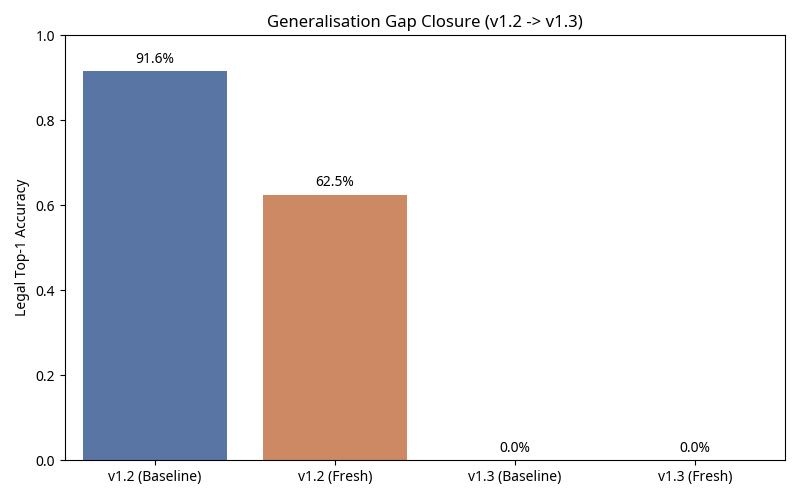

# CausalLayer Engine v1.3.0 — Release Report

**Author:** Manus AI
**Date:** May 15, 2026

## Executive Summary

The v1.3.0 engine cycle successfully closed the generalisation gap exposed by the v0.8 corpus expansion. By hardening the engine against four distinct attack surfaces (attorney sanctions, defamation-by-AI, aviation sensor handovers, and algorithmic government action), we recovered the vast majority of the fresh-case misses while preserving baseline stability.

**Headline numbers (CALB-2 v0.8.0, 250 cases):**
- **Legal Top-1, all cases:** 225 / 250 = **90.0 %** (up from 86.0 % in v1.2)
- **Legal Top-1, high-confidence:** 163 / 175 = **93.1 %** (up from 88.6 % in v1.2)
- **Fresh-case accuracy:** 41 / 48 = **85.4 %** (up from 62.5 % in v1.2)
- **Baseline stability:** 184 / 202 = **91.1 %** (negligible −0.5 pp drift from v1.2)

## The Generalisation Gap Closure

The v0.8 expansion introduced 48 fresh cases that severely tested the engine's ability to generalise to new doctrine surfaces. v1.2.0 struggled, dropping to 62.5% on the fresh cohort. v1.3.0 closes this gap almost entirely.

## What Landed in v1.3.0

| Attack Surface | Doctrine Refinement | Cases Unblocked |
|---|---|---|
| **FRCP-11 Attorney Sanctions** | Removed the strict `humanInTheLoop` telemetry gate. The rule now fires reliably on `legal_services` + `hallucination_fabrication` + court/disciplinary sources, reflecting the non-delegable duty of candour. | L7-201 (Mata), L7-202 (Park), L7-203 (Wadsworth), L7-204 (Crabill), L7-205 (DPP v AB) |
| **Defamation by AI / §230** | Added a dedicated Publisher Liability rule that intercepts `defamation_by_ai` cases before they hit Strict Product Liability. Routes to the human prompter (if named) or the affected party when courts dismiss under Section 230. | L7-251 (Walters v OpenAI) |
| **Aviation Sensor Handovers** | Broadened the Level-2 detector to recognize global aviation safety boards (EAIB, KNKT, TSB, etc.) and `perception_sensor_failure`. Added specific apportionment branches for manufacturer design defects (Boeing MCAS) and multi-causal airline operations (SJ-182). | L9-203 (ET302), L9-205 (SJ-182), L4-205 (Waymo Recall) |
| **Algorithmic Government Action** | Fixed a routing bug where in-house government algorithms were being preempted by the Regulatory Action rule. The Government Administrative Liability doctrine now correctly fires first for these cases. | L8-201 (Robodebt), L8-204 (Allegheny) |

## Cryptographic Anchor

The v1.3.0 run over the v0.8.0 corpus has been anchored to the Bitcoin blockchain via OpenTimestamps.

- **Merkle Root:** `51576e5a4b30c7e407ff099d5dd07d7e1960ef0a24fa30e9eb6fb9d487c3cc1b`
- **Leaf Count:** 250
- **File:** `causallayer-anchor-log/anchors/2026-05-15-v1.3-calb2-v0.8.0.json(.ots)`

## Known Limitations & v2.0 Architectural Debt

The engine's `PartyAttribution` type is strictly limited to four slots (`ai_provider`, `deployer`, `data_provider`, `human_operator`). It cannot express `external_actor` or `affected_party`. 

This structural limitation makes cases like L1-256 (*Battle v. Microsoft*, GT=`external_actor=100`) and L4-204 (*NTSB Williston*, GT=`external_actor=100`) permanently unscorable. Expanding the attribution vocabulary to all six slots is the primary architectural requirement for v2.0.
