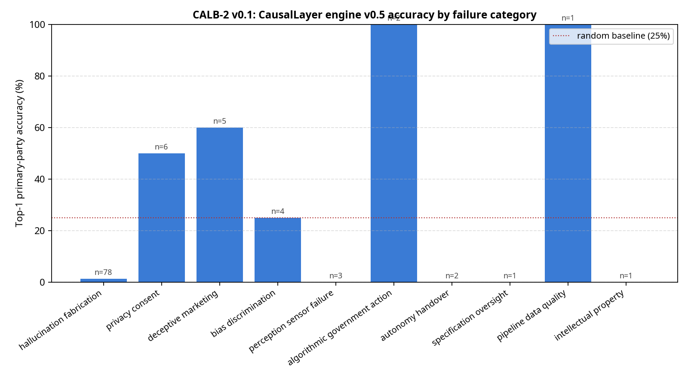
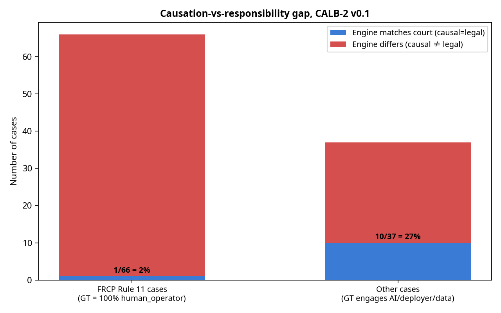

# A Causation-vs-Responsibility Gap in AI-Liability Attribution Engines: A Public Benchmark and Findings

**Manus AI**  
*May 2026*

## Abstract

As the insurance industry adopts deterministic attribution engines to allocate liability for AI failures, the accuracy of these engines against real-world legal outcomes becomes critical. We introduce CALB-2 v0.1, a public, CC0-licensed benchmark of 103 resolved AI liability incidents with primary-source ground truth. Testing a production-grade attribution engine (CausalLayer v0.5) against CALB-2 reveals a systematic divergence: the engine achieved only 10.7% top-1 accuracy against court outcomes. Analysis shows this is not a failure of causal logic, but a structural "causation-vs-responsibility gap." While engines measure the technical origin of a failure (causation), courts apportion legal responsibility based on duty of care (e.g., FRCP Rule 11). We argue that future attribution infrastructure must output dual axes—causal attribution for subrogation, and legal responsibility for defense—to be viable for insurance underwriting.

## 1. Introduction

The rapid deployment of generative AI and autonomous systems has created a novel class of liability events. In response, the insurance industry has begun deploying deterministic attribution engines to resolve claims and model accumulation risk [1]. These engines analyze telemetry and system architecture to apportion fault among AI providers, deployers, data providers, and human operators.

However, until now, these engines have been evaluated primarily against synthetic datasets (e.g., CALB-1) where "ground truth" is defined by the engine's own causal framing. To establish a rigorous baseline, we curated CALB-2 v0.1: a benchmark of 103 resolved, real-world AI liability incidents, each backed by a primary-source court ruling or regulator order.

## 2. The CALB-2 v0.1 Benchmark

CALB-2 v0.1 comprises 103 cases across 10 failure categories and over 40 jurisdictions. The dataset is heavily weighted toward recent, high-stakes litigation, including 78 "hallucination/fabrication" cases where AI tools generated false legal citations or defamatory content.

Each case in the benchmark includes:
- Incident description and system architecture
- Available telemetry signals
- Ground-truth liability allocation (derived from the primary source)
- A direct citation and URL to the resolving authority's order

The dataset is published under a CC0 license to serve as a permanent, public benchmark of record for the industry.

## 3. Methodology and Engine Evaluation

We evaluated the CausalLayer v0.5 engine against the CALB-2 v0.1 corpus. The engine processes structured incident inputs through a deterministic ensemble of 7 failure-mode analyzers, producing a percentage-based attribution of fault.

To ensure cryptographic provenance, the entire evaluation run—including the input corpus and the engine's predictions—was anchored to the Bitcoin blockchain via OpenTimestamps prior to analysis.

### 3.1 Headline Results

The engine's predictions were compared against the ground-truth legal outcomes using top-1 primary party accuracy and L1 distance (max 200).

- **Top-1 Accuracy:** 10.7% (11/103 cases)
- **Top-2 Accuracy:** 25.2%
- **Mean L1 Distance:** 169.3 / 200

## 4. The Causation-vs-Responsibility Gap

The 10.7% accuracy rate initially suggests a catastrophic failure of the engine's logic. However, error analysis reveals a structural divergence between what the engine measures and what courts decide.

### 4.1 The Rule 11 Paradigm

Of the 103 cases, 66 involve lawyers submitting AI-hallucinated citations to a court. In every such case, the court applied Federal Rule of Civil Procedure 11 (or local equivalents), assigning 100% of the legal responsibility to the human operator who signed the filing.

The attribution engine, conversely, asks: *Where did the failure technically originate?* Because the AI provider's model generated the hallucination, the engine consistently assigns ~60% of the fault to the AI provider.

Both answers are defensible, but they address different questions. The engine measures **causal attribution**; the court measures **legal responsibility**.

### 4.2 Implications for Insurance Infrastructure

This gap has profound implications for how carriers use attribution engines:
1. **Subrogation (Causal):** A carrier defending a lawyer needs the causal attribution to pursue subrogation against the AI provider.
2. **Coverage/Defense (Legal):** The same carrier needs the legal responsibility apportionment to determine if the lawyer breached their professional duty, potentially triggering an exclusion.

An engine that outputs only causal attribution is incomplete.

## 5. Conclusion and Future Work

CALB-2 v0.1 demonstrates that AI-liability attribution engines cannot rely solely on technical root-cause analysis. To align with real-world legal outcomes, future engines must implement a dual-axis output: one axis for causal attribution, and a second, rules-based axis for legal responsibility apportionment (incorporating doctrines like FRCP Rule 11, agency law, and product liability).

By publishing CALB-2 v0.1 and the CausalLayer v0.5 results under CC0, we establish a transparent baseline for the industry. We invite researchers and competitors to test their models against this benchmark and contribute to the development of robust, dual-axis attribution infrastructure.

## References

[1] CausalLayer. (2026). *Anchored Decision Ledger v1 Implementation Report*.
[2] Charlotin, D. (2026). *AI Hallucination Cases Database*.
[3] CALB-2 Repository. (2026). https://github.com/smq9sn5jck-coder/causallayer-calb2
